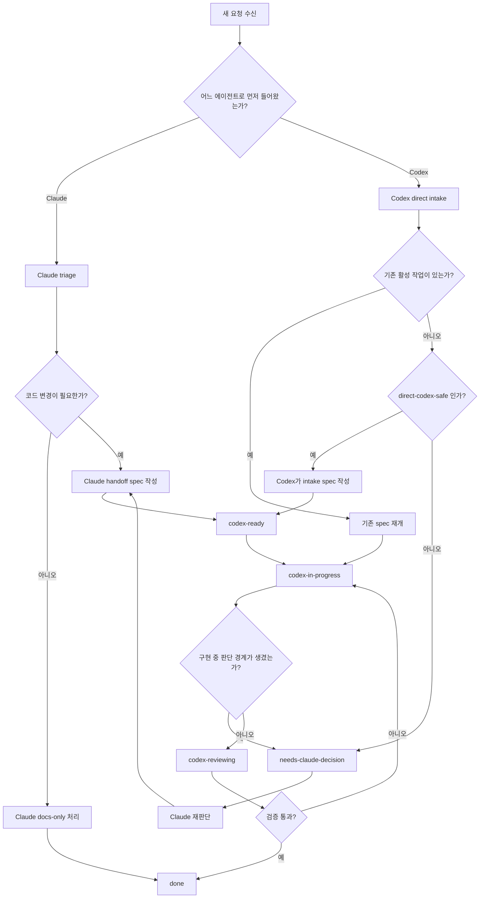
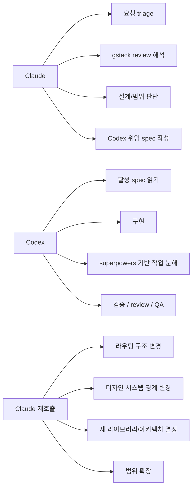
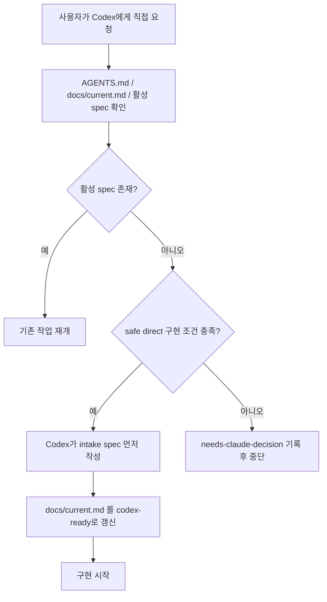

# 에이전트 handoff harness 개요

이 문서는 사람이 Claude-Codex handoff 구조를 빠르게 이해하기 위한 참고 문서다. 실제 강제 규칙은 `AGENTS.md`와 `docs/operations/agent-handoff-harness.md`를 따른다.

## 한 줄 요약

- Claude는 무엇을 해야 하는지 정리한다.
- Codex는 어떻게 구현할지 실행한다.
- 둘의 접점은 slash command가 아니라 `codex-ready` 상태와 활성 작업 문서다.

## 전체 흐름 개요

## 역할 분리 요약

## direct-to-codex 요청의 안전장치

## 사람이 읽는 포인트

- `/review`는 중요하지만 유일한 시작점은 아니다. 구현 요청은 모두 결국 `codex-ready` 산출물 게이트를 통과해야 한다.
- direct-to-codex 요청도 바로 구현으로 가지 않고, 먼저 intake와 문서 게이트를 거친다.
- `docs/current.md`는 현재 활성 상태를, `docs/tasks/*.md`는 실제 작업 계약을 나타낸다.
- 문서 충돌이나 저장소 경계 문제가 생기면 구현보다 상태 정규화와 재판단이 먼저다.
